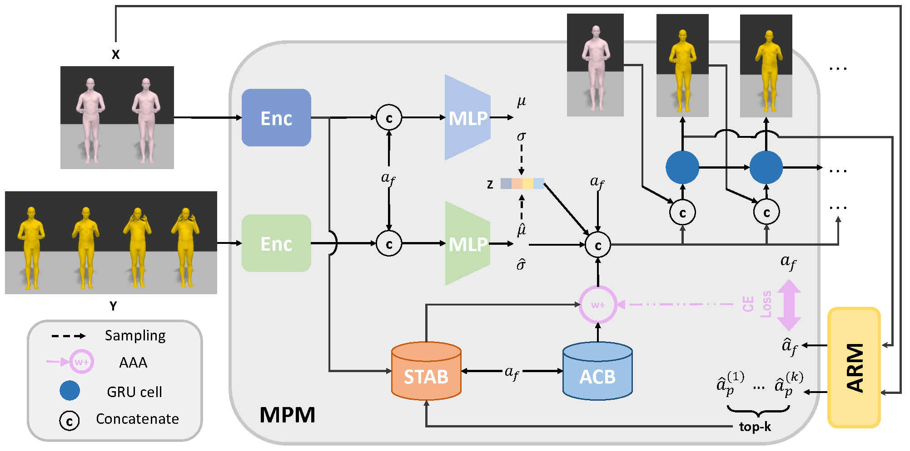

# Stochastic Human Motion Prediction with Memory of Action Transition and Action Characteristic

Code for ``Stochastic Human Motion Prediction with Memory of Action Transition and Action Characteristic'' (CVPR2025)

**[[paper]]()   [[homepage]](https://hyqlat.github.io/STABACB.github.io/)**

## Abstract

<div style="text-align: center;">
    
</div>

Action-driven stochastic human motion prediction aims to generate future motion sequences of a pre-defined target action based on given past observed sequences performing non-target actions. This task primarily presents two challenges. Firstly, generating smooth transition motions is hard due to the vary transition speed of different actions. Secondly, the action characteristic is difficult to be learned because of the similarity of some actions. These issues cause the predicting results being unreasonable and inconsistent. As a result, we propose two memory banks, the Soft-transition Action Bank (STAB) and Action Characteristic Bank (ACB), to tackle the problems above. The STAB stores the action transition information. It is equiped with the novel soft searching approach, which encourages the model to focus on multiple possible action categories of observed motions. The ACB records action characteristic, which produces more prior information for predicting certain action. To fuse the features retrieved from two banks better, we further propose the Adaptive Attention Adjustment (AAA) strategy. Extensive experiments on four motion prediction datasets demonstrate that our approach consistently outperforms the previous state-of-the-art.

## Implementation

### 1.Installation

##### Environment

* Python == 3.9.19
* PyTorch==1.12.1

##### Dependencies

Install the dependencies from the :`requirements.txt`

```bash
pip install -r requirements.txt
```

##### Pre-processed Data

The pre-processed datasets can be found in the [project page of WAT](https://github.com/wei-mao-2019/WAT?tab=readme-ov-file#datasets). Download all the files to `../data` folder.

##### Pre-trained Models

**coming soon... [no joking :)]**

Download all the files to `./results` folder.

### 2.Training

Use the scripts `run_{NAME_OF_DATASET}.sh` to train corresponding dataset. The YAML configs can be found in `./motion_pred/cfg/`.

##### Training ARM

Use the **train conti class** lines in script `run_{NAME_OF_DATASET}.sh` to train Action Recognition Module. The YAML config can be found in `./motion_pred/cfg/{NAME_OF_DATASET}_cc.yml`.

##### Training MPM

Use the **train** lines in script `run_{NAME_OF_DATASET}.sh` to train Motion Prediction Module. The YAML config can be found in `./motion_pred/cfg/{NAME_OF_DATASET}_rnn.yml`.

### 3.Testing

Use the **test** lines in script `run_{NAME_OF_DATASET}.sh` for testing. The YAML config can be found in `./motion_pred/cfg/{NAME_OF_DATASET}_rnn.yml`.

### 4.Visualization

Download smpl-(h,x) models from their official websites and put them in `./SMPL_models` folder.

And use the **visualization** lines in script `run_{NAME_OF_DATASET}.sh` for visualization. The YAML config can be found in `./motion_pred/cfg/{NAME_OF_DATASET}_rnn.yml`.

## Acknowledgements

We sincerely thank the authors of [WAT](https://github.com/wei-mao-2019/WAT) for providing the source code and the pre-processed data from their publication. These resources have been invaluable to our work, and we are immensely grateful for their support.

## Citation
